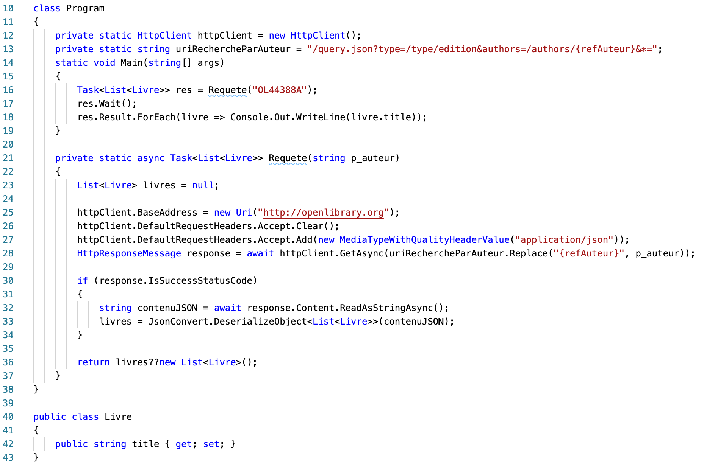

# Module 02 - REST - Introduction

## Préambule

- Créez une solution contenant un projet de type console.
- Adaptez le code suivant dans votre projet et testez-le ligne par ligne
- Que fait ce code ?



## Outils pour vos tests

### Effectuer des requêtes HTTP sans code

- Téléchargez et installez l'application Postman (https://www.postman.com/)
- Dans ce logiciel, effectuez une requête de type GET avec l'adresse suivante : "http://openlibrary.org/query.json?type=/type/edition&authors=/authors/OL44388A&*="
- Observez le résultat et les différents indicateurs de l'outil (nous reviendrons dessus plus tard)
- Copiez le résultat du corps ("Body")

### Décortiquer un document JSON

- Allez sur le site : https://codebeautify.org/jsonviewer
- Collez le texte JSON dans la partie de gauche et explorez les options du centre de la page (Tree Viewer, Beautify) et de la partie droite (tri, filtre, etc.)

***Attention : n'utilisez jamais un site du genre avec des données sensibles, car vous ne maitrisez pas ce que le site en fait***

## Exercice 1 - Retour sur les municipalités

- Reprenez la proposition de correction du Module 1 ou votre propre code.
- Ajoutez le projet "M01_DAL_Import_Munic_REST_JSON"
- Ajoutez les packages Nuget "Microsoft.AspNet.WebApi.Client" (facilite la création de requêtes HTTP) et "Newtonsoft.Json" ((Dé)sérialisation JSON)
- Ajoutez-y une classe qui implante l'interface "IDepotImportationMunicipalite"
- Dans le constructeur, instanciez un HttpClient que vous allez garder dans une donnée membre
- Codez la méthode "LireMunicipalite" :
  - Spécifiez la bonne adresse de base : "https://www.donneesquebec.ca"
  - Effacez l'entête des fichiers acceptés de votre objet de requêtes
  - Ajoutez l'entête de fichiers acceptés "application/json"
  - Utilisez la méthode "GET" pour obtenir les données présentes à l'adresse :  https://www.donneesquebec.ca/recherche/api/action/datastore_search?resource_id=19385b4e-5503-4330-9e59-f998f5918363&limit=3000
  - Pour réaliser cette requête, inspirez-vous du code du préambule
  - Utilisez la bibliothèque Newtonsoft.Json de Newtonsoft
- Modifiez votre programme principal afin qu'il utilise maintenant le dépôt de type JSON pour faire vos exécutions.

## Exercice 2 - Utilisation d'un projet open source de vision

Pré-requis :

- Docker
- Connexion réseau
- Des images avec des visages

Dans cet exercice, vous allez utiliser l'API de vision [deepstack](https://www.deepstack.cc) afin détecter les visages (Face detection) dans une image. [Le code du projet se trouve sur un dépôt GitHub](https://github.com/johnolafenwa/DeepStack). Le dépôt contient un fichier README.md très riche.

Écrivez un programme qui va :

- Prendre une image en paramètre
- Envoyer cette image à l'API de vision de détection de visages
- Dessiner un rectangle rouge autour des visages
- Enregistrer l'image résultante dans le répertoire "output"

Pour cela, vous allez utiliser les documentations suivantes :

- Lancer le conteneur contenant l'image docker de DeepStack en suivant [la documentation](https://docs.deepstack.cc/getting-started/index.html)
- Regarder l'exemple de la documentation de l'[API de vision](https://docs.deepstack.cc/face-detection/index.html) afin de voir comment l'exploiter. Vous avez des exemples en C#, il suffit de cliquer sur l'onglet "C#" de chaque exemple pour voir le code
- Pour récupérer le nom de l'image, vous devez utiliser le paramètres "args" de la classe "Program". Vous pouvez utiliser [cette page pour vous aider](https://dailydotnettips.com/how-to-pass-command-line-arguments-using-visual-studio/)
- Pour modifier l'image, vous devez utiliser le package nuget "SixLabors.ImageSharp.Drawing" (Si le package ne s'affiche pas cochez la case "include prerelease"). Exemple de code :

```csharp
using (var img = Image.Load(image_path))
{
    img.Mutate(ctx =>
            ctx.Draw(Color.Red, 2.0f, new RectangleF(
                rectangle.x_min, rectangle.y_min, rectangle.x_max - rectangle.x_min, rectangle.y_max - rectangle.y_min
            )
        )
    );
    img.Save($"output/{image_path}");
}
```

Pour tester l'exercice, ma fille s'est donnée à fond : les visages sont penchés, il y a présence de grimages, etc. mais malgré cela, le système fonctionne.


## Exercice 3 - Météo

- Créez une nouvelle solution avec un projet de type console
- Le projet console (interface utilisateur) doit proposer un menu qui permet :
  - De rechercher les villes disponibles à partir des données de latitude et de longitude
  - D'afficher la météo d'une ville saisie (Le nom de la ville et non son woeid)
  - De quitter le programme
- Avant d'aller plus loin, essayez de comprendre un peu mieux les données que vous allez manipuler en naviguant les URIs suivantes :
  - https://geocoding-api.open-meteo.com/v1/search?name=Québec
  - https://api.open-meteo.com/v1/forecast?latitude=46.81228&longitude=-71.21454&hourly=temperature_2m&current_weather=true
- Créez deux autres projets :
  - Un projet contenant la couche de services pour répondre aux différents besoins de l'interface utilisateur
  - Un projet contenant la couche d'accès aux données qui effectue les requêtes à l'API REST
- La documentation de l'API est disponible à l'adresse suivante : https://open-meteo.com/en/docs#api_form

<!-- ## Exercice 3 - Actualité - COVID 19 (Optionnel)

- Explorez l'API covid19api.com.
- Créez un programme qui :
  - Au premier lancement, importe toutes les données du "Canada" et insérez-les dans une base de données
  - Aux lancements subséquents, importe seulement les données des jours non déjà importées -->
