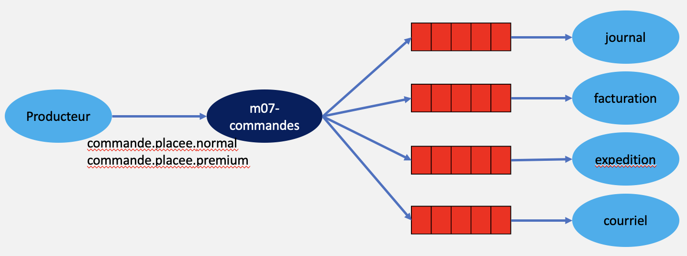

# Module 07 - Pub / sub - Topic

## Exercice 1 - Traitement d'une commande

Le but de l'exercice est de simuler un système de gestion de commandes. Un message "commande placée" est généré et quatre consommateurs le lis et effectue un traitement différent (journalisation, préparation de la facture, préparation de l'expédition, envoie d'un courriel dans le cas d'une commande premium)

Tout au long de l'exercice, je vous conseille de prendre le schéma suivant et de le compléter en vous inspirant de celui du cours :

### Exercice 1.1 - Création du producteur

- Créez la solution "DSED_M07_TraitementCommande". Le premier projet doit s'appeler "DSED_M07_TraitementCommande_producteur" et est de type "console"
- Ce programme va émettre des messages "Commande placée" dans un échange nommé "m07-commandes" en utilisant les sujets suivants : "commande.placee.normal" et "commande.placee.premium"
- Une commande contient un nom de client, une référence de commande (le type de variable C# est libre, mais la référence doit être unique), une liste d'articles. Un article a une référence, un nom, un prix et une quantité
- Les messages doivent contenir un objet composé des informations de la commande sérialisé en JSON.

***Pour simplifier votre programme, la commande est générée aléatoirement, c'est à dire qu'on ne demande pas d'interface de saisie, on simule simplement une commande qui pourrait provenir d'un site web ou d'une application mobile. Le choix "normal" ou "premium" et aussi aléatoire et vous indique sur le sujet.***

### Exercice 1.2 - Création d'un journal

- Créez le projet "DSED_M07_TraitementCommande_journal" de type "console"
- Ce programme doit lier l'échange "m07-commandes" à la file de messages "m07-journal" et accepter tous les messages de n'importe quel sujet.
- À la réception d'un message, il enregistre le contenu du message dans un fichier dont le nom débute par l'année, le mois, le jour, l'heure, le nombre de minutes, le nombre de secondes et un numéro unique avec le format suivant : "AAAAMMJJ_HHMMSS_Nouveau_Guid.json"

### Exercice 1.3 - Création de la facture

- Créez le projet "DSED_M07_TraitementCommande_facturation" de type "console"
- Ce programme doit lier l'échange "m07-commandes" à la file de messages "m07-facturation" et accepter tous les messages dont le sujet débute par "commande.placee"
- À la réception d'un message, il calcule de montant de la facture. Si la commande est de catégorie premium, il enlève 5%. Il calcule aussi les taxes avec les taux actuels appliqués dans la province du Québec. La liste des articles, ainsi que le total sans et avec taxes sont enregistrés dans un fichier par commande dont le nom débute par par l'année, le mois, le jour, l'heure, le nombre de minutes, le nombre de secondes et la référence de la commande avec le format suivant : "AAAAMMJJ_HHMMSS_ReferenceCommande_Facture.json"

### Exercice 1.4 - Préparation de l'expédition

- Créez le projet "DSED_M07_TraitementCommande_Expedition" de type "console"
- Ce programme doit lier l'échange "m07-commandes" à la file de messages "m07-preparation-expedition" et accepter tous les messages dont le sujet débute par "commande.placee"
- À la réception d'un message, il affiche sur la console "Préparez les articles suivants :" suivi de la liste des articles. Le programme affiche aussi s'il faut utiliser un emballage normal ou premium.

### Exercice 1.5 - Envoie de courriel pour les commandes Premium

- Créez le projet "DSED_M07_TraitementCommande_CourrielsPremium" de type "console"
- Ce programme doit lier l'échange "m07-commandes" à la file de messages "m07-courriel-premium" et accepter tous les messages dont le sujet est  "commande.placee.premium"
- À la réception d'un message, il affiche sur la console "Commande premium" suivi du numéro de référence de la commande.
